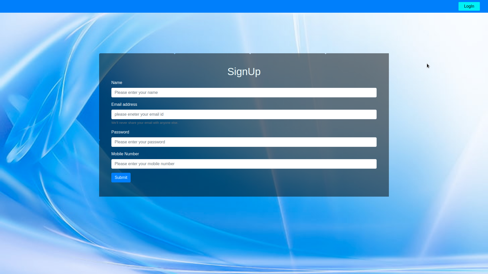
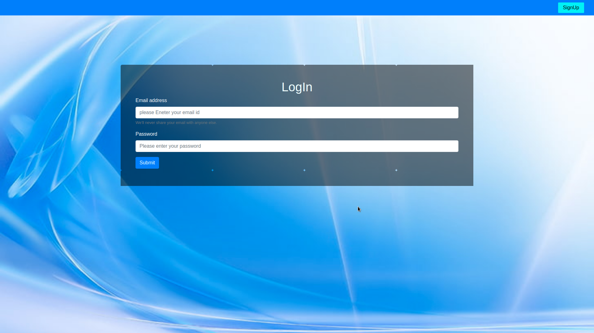
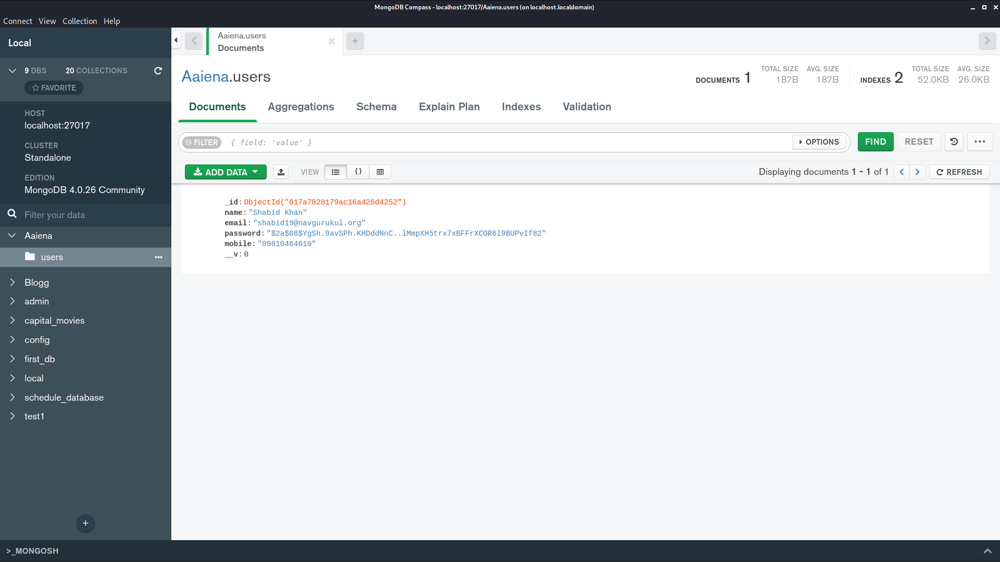

<h1 align="center">
    <b>User Registration & Login systems in<br> Node.js using MongoDB </b> 
<br>
</h1>


<p align="center">
  <a href="/LICENSE"></a>
</p>


## What is this for?
This is a Simple User Registration & Login systems app done with ExpressJS framework of NodeJS using MongoDB as the data store, Express as the routing system, Body-parser as the parser for webpage, Express-cookie-parser used  to track the user's cookie and of course Mongoose to make interacting with Mongo from Node easy.

## Getting Started

## Running the tests

### •Registration Form:
Allows the user to register their account by filling their Email, Username, Password, and Mobile Number.



### •Login Form:
If the user has been registered on the app, can login by passing the credentials.



### •User's Profile:
After the user logged in, a simple profile with the user's username <br>displayed with a Logout button.


### DataBase:
Here we use **[MongoDB](https://www.mongodb.com/)** as the database. Here we have one collection created, named as:
- users.

A Collection(**Users**) is populated with the user's credentials.

<br><br>

<br>
<br>
<br>

## Prerequisites
Tools that we need to run this app:

- ***[Node.js](https://nodejs.org/)***
- ***[Express.js](https://expressjs.com/)***
- ***[Node Package Manager](https://www.npmjs.com/get-npm)***
- ***[MongoDB](https://www.mongodb.com/)***

## Installing
```
npm install
```
## Connection to DataBase Access
At line 4 on ```./db/db.js``` change ***```process.env.dbUrl```*** with your DataBase Url or create a ```.env``` file with ***```dbUrl = <your_DataBase_Url>```*** .

## To Run the App
```
node bin/www
```

The server will start Running on
+ http://localhost:9000/


## Author

| Author                | Profile Link                                       |
| --------------------- | :------------------------------------------------- |
| **Shabid Khan** | **[Shabid Khan](https://github.com/shabidkhan)** |


<br>

##


<br><br>
<div align="center">
<a href="https://www.buymeacoffee.com/YwGKcxa" target="_blank"></a></div>
<p align="center">
  Made with ❤️ by <a href="https://github.com/shabidkhan">Shabid Khan</a>
</p>
